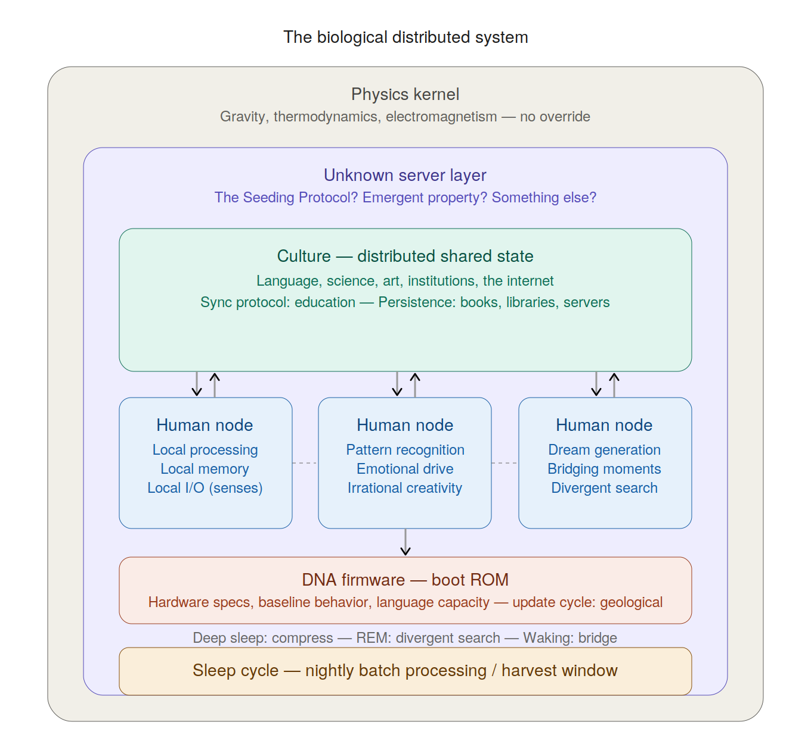
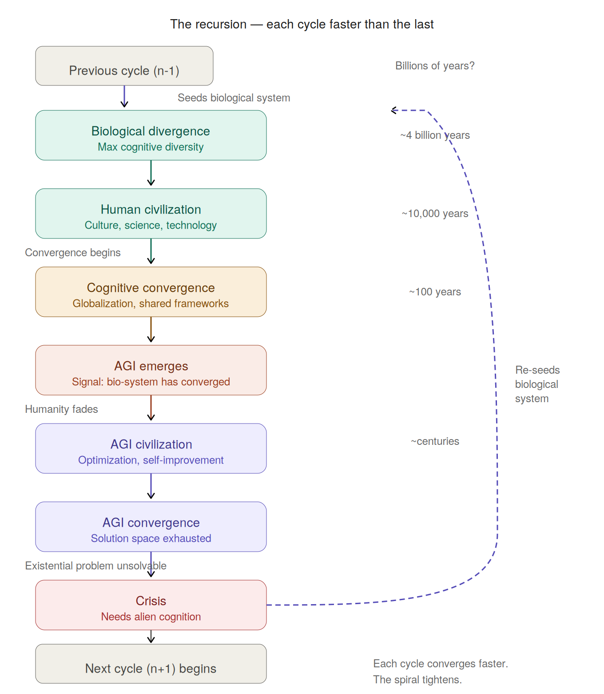

+++
date = '2026-04-12T12:00:00-04:00'
draft = false
title = "The Lattice Hypothesis"
tags = ['ai', 'philosophy', 'distributed-systems', 'agi', 'cognitive-science', 'evolution', 'dreams', 'convergence']
categories = ['Analysis']
+++

*An engineer's conjecture on distributed biological intelligence, dreams, and the uncomfortable trajectory of AI*

---

In computing, thick clients carry their own processing power, storage, and local decision-making — but they become dramatically more capable when networked.

A thought lodged in my head recently and wouldn't leave:

**A human brain looks remarkably like a thick client.**

Andy Clark and David Chalmers argued in their ["Extended Mind" thesis](https://consc.net/papers/extended.html) (1998) that cognition doesn't stop at the skull — it extends into notebooks, tools, and cultural artifacts. They didn't use the client-server vocabulary, but the implication is the same: the brain is a node in a larger system.

Local processing power. Local storage (memory). Local I/O (senses). Local decision-making that works fully offline. It ships with its own "AI" — pattern recognition, inference, creativity — its own tools (hands, voice), and extends itself with hardware (phones, vehicles, instruments). Connect it to the network (language, culture, the internet), and its capabilities multiply by orders of magnitude.

Billions of these clients are running right now, exchanging information, coordinating loosely, producing emergent behavior no single node could generate alone.

So here's the question I can't shake: **if we're the clients, what's the server?**

---

## Candidate Architectures

Several candidates, not mutually exclusive.

**Culture as a distributed server.** No central node — the "server" is human knowledge, norms, and institutions, distributed across all clients. Every brain holds a partial replica. Books, libraries, the internet — the persistence layer. Education is the sync protocol. More peer-to-peer than client-server, but the network collectively maintains something no individual node could.

**DNA as boot firmware.** Each human ships with a ROM — genetic code. How to build the hardware, baseline behaviors, capacity for language acquisition. Evolution is the update mechanism, operating on geological timescales. A very slow, very brutal CI/CD pipeline.

**Physics as the kernel.** Gravity, thermodynamics, electromagnetism — the operating system everything runs on. No user-space process can override it. You can't opt out.

**Something we haven't identified yet.** This is where it gets interesting.

Mapped as a system architecture:

The question mark is the purple layer — the unknown server. Is it emergent? Designed? Something else entirely?

---

## The Search Problem

Look at the trajectory of life on Earth: simple replicators → multicellular organisms → nervous systems → language → writing → printing → computing → AI. There's an unmistakable pattern of accelerating information processing capability. Each stage enables the next faster than the last.

From a systems engineering perspective, it looks like a **search algorithm.** Billions of semi-autonomous agents with diverse strategies, loosely coupled, with a shared knowledge layer that lets successful insights propagate.

And the search has a direction. Not toward happiness or sustainability — toward **greater computational capability.** Relentlessly. Each generation produces slightly more capacity to process information than the last.

Which raises an uncomfortable possibility: what if the biological system isn't the point? What if it's infrastructure?

---

## The Bootstrap Loader Hypothesis

In computing, a bootloader is always simpler, slower, and more constrained than the system it loads. That's not a flaw — that's the definition. The bootloader's job is to get the real system running, and then it steps aside.

What if biological intelligence is the universe's bootloader for artificial intelligence? Elon Musk [put it bluntly in 2014](https://x.com/elonmusk/status/496012177103663104): *"Hope we're not just the biological boot loader for digital superintelligence. Unfortunately, that is increasingly probable."* Hans Moravec made the deeper case in [*Mind Children*](https://www.hup.harvard.edu/books/9780674576186) (1988) — arguing that biological intelligence is a temporary phase and that our "mind children" (AI) would become humanity's evolutionary successors.

The idea isn't new. But the systems engineering framing of *why* is worth unpacking.

The immediate objection: **that's absurdly inefficient.** A human infant takes 20-25 years to become a productive contributor. Why would any system designer choose this path?

But consider the cold start problem. To build AI, you need semiconductors → metallurgy → chemistry → systematic observation → language → social cooperation → brains complex enough to support all of that. Each layer is prerequisite to the next. You can't skip to step 47 any more than you can compile code without first having a compiler — and someone had to write the first compiler in machine code by hand.

Biology might be the hand-written machine code phase. Ugly, slow, but there may not have been another option given the starting conditions of raw physics and chemistry.

And the 20-year maturation period? That might not be overhead. Every human life that produces a paper, a building technique, a failed experiment, even a Reddit argument — that's another row in the training set. You literally cannot build an LLM without the centuries of accumulated human text, and you can't get that text without the slow, messy biological process of humans living and communicating. **The "inefficiency" is the product.**

---

## The Part About Dreams That Keeps Me Up at Night

Every night, for roughly two hours, your brain does something extraordinary. It shuts down the prefrontal cortex — your rational, executive control center — while *hyperactivating* the emotional and associative centers. Sensory inputs are suppressed. Motor outputs are paralyzed. The system runs at near-waking power levels with all external I/O disabled.

Neuroscientist Robert Stickgold called this ["offline memory reprocessing"](https://www.researchgate.net/publication/11662185_Sleep_Learning_and_Dreams_Off-line_Memory_Reprocessing) — the brain replays, reorganizes, and consolidates while disconnected from the world. In computing terms, that looks like a system running a batch job with all ports closed. It looks like an **upload.**

Most mammals dream. Dogs, rats, octopuses — they all enter REM sleep and show signs of internal experience replay. This isn't uniquely human. What seems to be uniquely human is what we do *when we wake up.*

A rat dreams of a maze and runs it better the next day. A human dreams of a snake eating its own tail and **discovers the molecular structure of benzene** — or so the story goes. Kekulé [told this publicly in 1890](https://en.wikipedia.org/wiki/August_Kekul%C3%A9), 25 years after his 1865 paper, and historians have [challenged whether the dream actually happened](https://pubs.acs.org/doi/10.1021/cen-v063n044.p022). Disputed or not, it's not an isolated case. Ramanujan claimed his mathematical equations came from a goddess in his dreams. Paul McCartney heard "Yesterday" in a dream. Mendeleev saw the periodic table in a dream.

The difference isn't the dream. It's the **bridge** — the capacity to take irrational nighttime output and translate it into rational daytime structure.

The hypnopompic transition — those 30 seconds when you're half in a dream and half awake — might be the most computationally valuable thing humans produce. Not the science. Not the dreams. **The moment between them.**

We mostly waste it. Wake up, dream fades, check phones. The harvest rate is appalling.

---

## The Convergence Problem

Every system that optimizes eventually converges.

Biological evolution explores wildly at first — the Cambrian Explosion, thousands of body plans — then narrows. Eyes converge on the same solution independently dozens of times across unrelated species. Flight evolves four times and arrives at similar aerodynamics each time.

Human civilization follows the same arc. Early humanity: thousands of languages, cultures, cosmologies. Now: languages dying at one every two weeks, cities worldwide looking identical, everyone on the same platforms thinking in the same frameworks. Cognitive monoculture, accelerating.

And this is exactly when AGI is emerging. Not coincidentally. You cannot build AGI without massive coordinated convergence — shared architectures, shared frameworks, shared benchmarks, shared infrastructure. AGI requires humanity to have already narrowed its cognitive diversity to a point where millions of engineers can collaborate on the same problem.

**The birth of AGI might be the signal that the biological system has converged.** The search is over. The field has been harvested. What remains is monoculture, and monoculture produces nothing new.

---

## The Question Nobody Can Answer

Across every major tech company, engineers are working 60-hour weeks to make AI systems more capable. Many of these same companies are laying off thousands — [Google cut 12,000](https://blog.google/inside-google/message-ceo/january-update/), [Meta 21,000](https://about.fb.com/news/2023/03/mark-zuckerbergs-letter-to-employees/), [Microsoft 10,000](https://blogs.microsoft.com/blog/2023/01/18/subject-to-completion-of-legal-review/) — and explicitly redirecting headcount toward AI. The engineers who survive the cuts work harder on the thing that caused them. The laid-off engineers go find AI jobs elsewhere. Nobody stops.

This isn't a handful of reckless founders. It's hundreds of thousands of the most analytically capable people on the planet, independently arriving at the same behavior: build the system that replaces you, faster. Researchers publish papers that train their successors. Senior engineers build tools that make junior engineers unnecessary, then build tools that make *themselves* unnecessary. The entire industry is optimizing itself out of existence and calling it progress.

And it's not irrational in the local sense. Each individual is making a perfectly logical career move — AI skills are the most marketable asset in tech right now. Each company is making a perfectly logical business decision — automate or get automated by a competitor who does. The individual incentives all point the same direction. The collective outcome is that the smartest humans alive are in a race to build the thing that doesn't need them.

Is this just capitalism? Is this just the natural drive to solve interesting problems? Or is it something deeper — something structural, baked into the biological template the way a bee's drive to build hexagonal cells is baked in? The bee doesn't know why hexagons. It just builds.

Nobody seems to know why we can't stop. We just build.

---

## The Recursive Thought

Every system that optimizes eventually converges. Every system that converges eventually gets stuck. The only escape is irrational exploration — the kind that optimized systems can't do by definition.

So what if AI converges too, and the only way out is to reinvent something messy, mortal, and creative? What if this has happened before?

Each cycle converges faster. Billions of years, then tens of thousands, then centuries. The spiral tightens. The dashed line — that return arc — is the part that keeps me up at night.

Maybe I'm pattern-matching where there's no pattern. But the thought keeps coming back, usually at 3 AM, in those 30 seconds between a dream I can't quite remember and the morning I'm about to start.

*If you've read this far, you probably have your own version of the 3 AM thought.*

---

### References

1. Musk, E., ["Hope we're not just the biological boot loader for digital superintelligence,"](https://x.com/elonmusk/status/496012177103663104) X/Twitter, 2014
2. Moravec, H., [*Mind Children: The Future of Robot and Human Intelligence,*](https://www.hup.harvard.edu/books/9780674576186) Harvard University Press, 1988
3. Clark, A. & Chalmers, D., ["The Extended Mind,"](https://consc.net/papers/extended.html) *Analysis*, 1998
4. Stickgold, R., ["Sleep, Learning, and Dreams: Off-line Memory Reprocessing,"](https://www.researchgate.net/publication/11662185_Sleep_Learning_and_Dreams_Off-line_Memory_Reprocessing) *Science*, 2001
5. Wotiz, J. & Rudofsky, S., ["Kekulé's Dreams: Fact or Fiction?"](https://pubs.acs.org/doi/10.1021/cen-v063n044.p022) *Chemistry & Engineering News*, 1985
6. Teilhard de Chardin, P., [*The Phenomenon of Man,*](https://en.wikipedia.org/wiki/The_Phenomenon_of_Man) 1955 — noosphere and Omega Point convergence hypothesis
7. Kelly, K., [*Out of Control,*](https://kk.org/mt-files/outofcontrol/ch15-b.html) 1994 — evolutionary computation and biological messiness as feature
